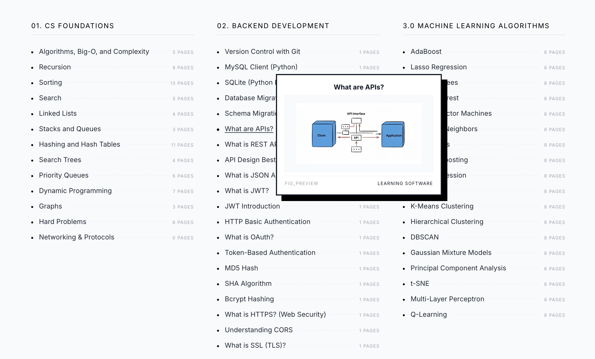
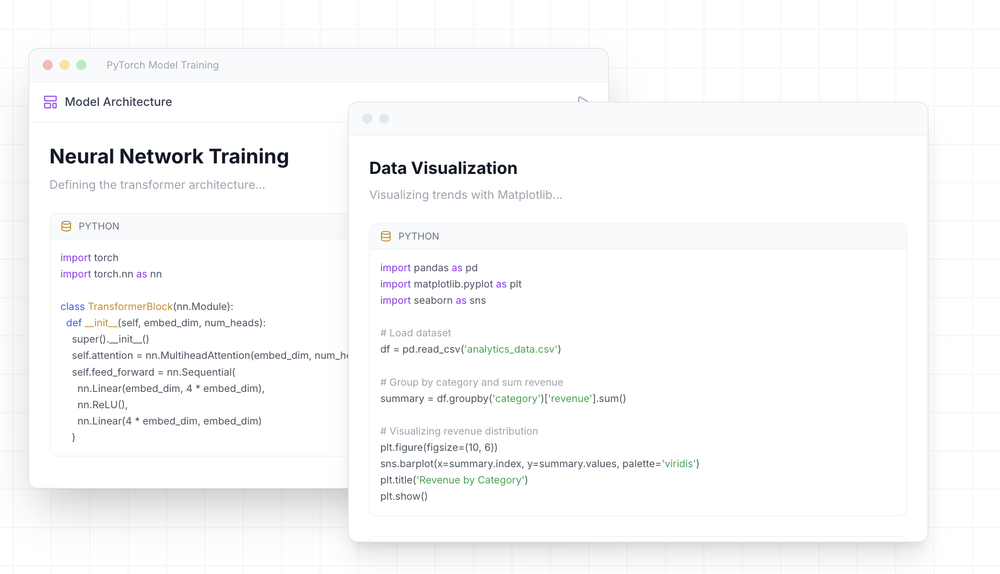
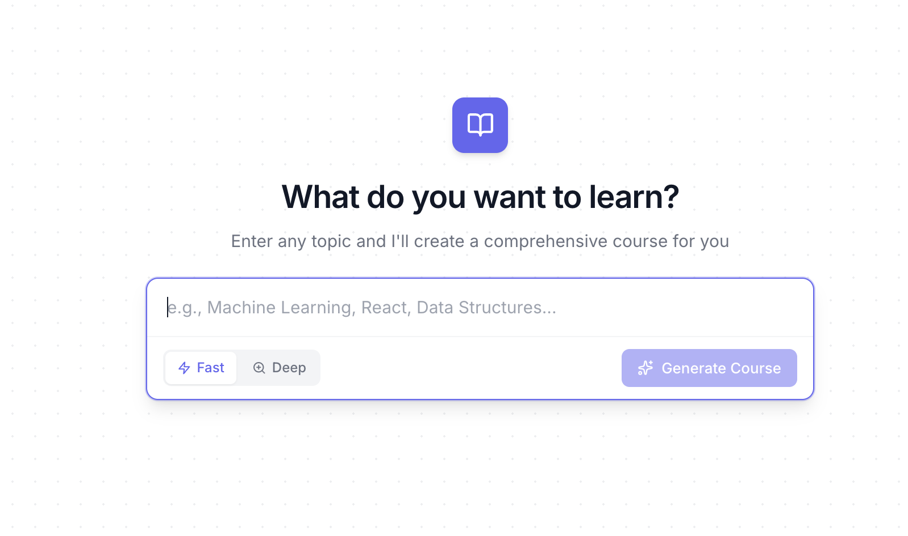
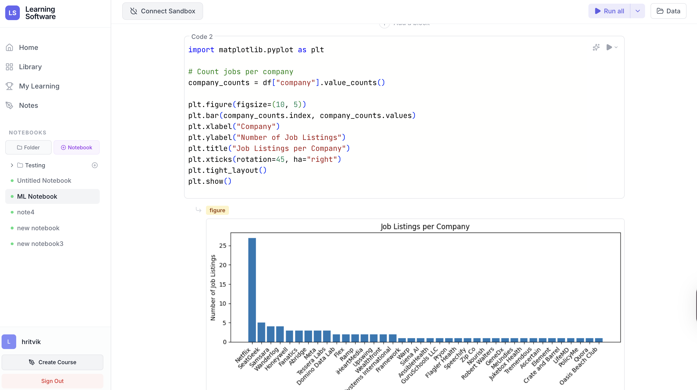
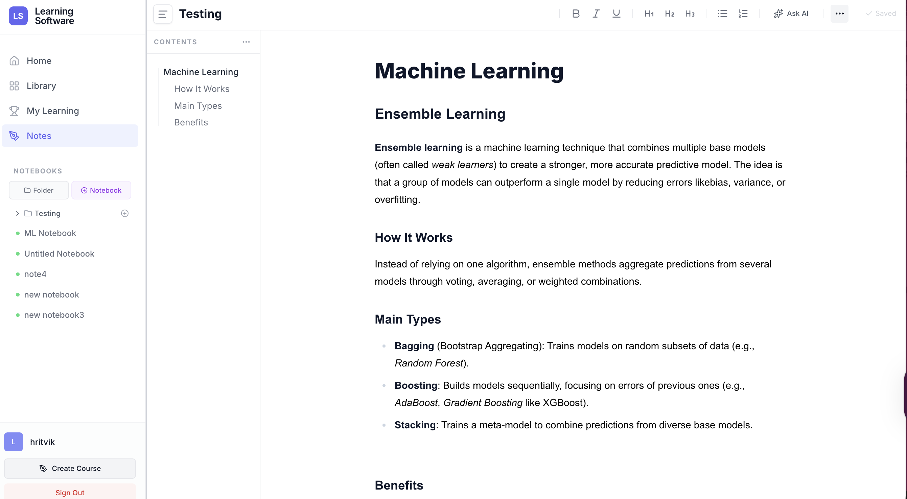

# Learning Software

### *The Interactive Book to Master Software Engineering*

*Seamless simulations, executable code, and deep explanations — all in one place.*

[🌐 Live Demo](https://www.learningsoftwares.com) • [📖 Course Catalog](#course-catalog) • [🚀 Get Started](#getting-started)

---

## What is Learning Software?

**Learning Software** is an interactive learning platform designed to help developers master software engineering concepts through hands-on practice. Unlike traditional tutorials or documentation, our platform combines rich educational content with real-time code execution, allowing you to learn by doing.

Whether you're preparing for technical interviews, upskilling for a new role, or diving deep into machine learning algorithms — we've got you covered.

---

## Features

### Diverse Courses in Software Engineering

Access a comprehensive library of courses covering everything from Data Structures & Algorithms to System Design, Machine Learning, DevOps, and more.

  

 

---

### Code & Learn - Interactive Code Execution

Practice coding directly within the platform. Write, run, and test your code with our built-in sandbox environment. Solve LeetCode-style problems and get instant feedback.

  

 

---

### Create Your Own Courses

Have expertise to share? Create and publish your own courses with our intuitive course builder. Structure your content, add code examples, and reach learners worldwide.

  

 

---

### Interactive Notebooks

Work with Jupyter-style notebooks directly in the browser. Experiment with code, visualize data, and document your learning journey in one place.

  

 

---

### Smart Note-Taking

Take notes as you learn with our integrated note-taking system. Organize your thoughts, highlight key concepts, and build your personal knowledge base.

  

 

---

## Course Catalog

### 01. CS Foundations
- Algorithms, Big-O, and Complexity
- Recursion
- Sorting & Search
- Linked Lists, Stacks & Queues
- Hashing and Hash Tables
- Priority Queues
- Dynamic Programming
- Graphs
- Hard Problems (NP)

### 02. Backend Development
- Version Control with Git
- MySQL & SQLite (Python)
- Schema Migration
- REST API & API Design
- JWT & OAuth Authentication
- HTTP Basic Auth
- MD5, SHA & Bcrypt Hashing
- CORS & SSL/TLS

### 03. Machine Learning
#### 03a. Basic Machine Learning
- Linear Regression
- Logistic Regression
- Calculus & Linear Algebra
- Forward & Backpropagation
- Activation & Loss Functions
- Layers & Optimizers
- Regularization

#### 03b. Advanced Machine Learning
- Model Calibration
- Popular Architectures
- Evaluation Metrics
- Multi-Objective Optimization
- Fine-Tuning & Ensemble Models

### 04. Natural Language Processing (NLP)
- Word Vectors
- NLP Tasks
- Language Models
- Machine Translation
- Word Sense Disambiguation
- Attention Mechanism
- Preprocessing & Tokenization

### 05. Large Language Models (LLMs)
#### 05a. Basic LLMs
- Transformer Architecture
- BERT by Google
- GPT & ChatGPT
- LLaMA by Meta
- Large Language Model Ops

#### 05b. Advanced LLMs
- Parameter Efficient Fine Tuning (PEFT)
- Retrieval Augmented Generation (RAG)
- Context Length & Hallucination
- Knowledge Graphs
- Mixture-of-Experts (MoE)
- Reinforcement Finetuning & Alignment
- Token Sampling
- DeepSeek R1, V3, Janus-Pro
- Qwen 2.5 & Qwen3
- Claude 4 Technical Primer

### 06. Computer Vision
- Vision Overview
- Diffusion Models
- Flow Matching
- CLIP
- Visual ChatGPT
- Multimodal Challenges

### 07. Recommender Systems
- Candidate Generation
- Ranking & Scoring
- Re-ranking
- Content Moderation
- Transformers for RecSys
- Cold Start Problem
- Multi-Armed Bandit
- Building Music Recommendations with PySpark

### 08. MLOps Specialization
- Model Compression & Privacy
- Debugging ML Models
- Amazon Kinesis & Kafka Stream
- Apache Flink & Spark Stream
- AWS Glue, EMR & SageMaker

### 09. DevOps & Infrastructure
- Docker
- Kubernetes & Orchestration
- CI/CD Pipelines

### 10. Languages (Deep Dives)
- Python for Beginners
- C++ for Systems
- Java Fundamentals
- JavaScript Fundamentals

### 12. System Design
#### 12a. Basic System Design
- System Design Basics
- Design Patterns
- Distributed Systems
- Scalability
- Secure Design
- Software Architecture Patterns

#### 12b. Advanced System Design
- Netflix Architecture
- YouTube Architecture
- Instagram Architecture
- Twitter Architecture
- Facebook Architecture
- Uber Engineering
- Spotify Engineering
- Discord Engineering
- Slack Engineering
- Dropbox Engineering
- GitHub Engineering
- Twitch Engineering
- Hotstar Engineering
- Payment Architectures
- E-Commerce Architecture
- Financial Systems & Algo-Trading
- Chrome Design
- IDEs Architecture

### 13. Domain Specific
- Frontend Development
- DevOps Engineer Role

---

## Getting Started

1. **Visit our website**: [learningsoftwares.com](https://www.learningsoftwares.com)
2. **Sign up** for a free account
3. **Explore** the course library
4. **Start learning** with interactive content

---

## Contributing

Want to contribute content or courses to Learning Software? We'd love to hear from you!

Visit our website and click the **"Create Course"** button to submit your course proposal. Share your LinkedIn profile and course idea, and our team will get back to you!

---

**Built with ❤️ by the Learning Software Team**

*© 2024 Learning Software. All rights reserved.*

